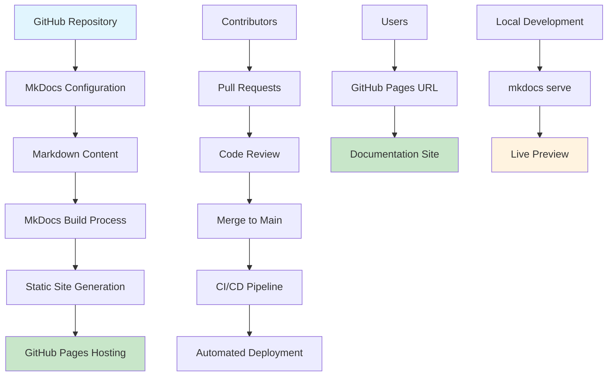
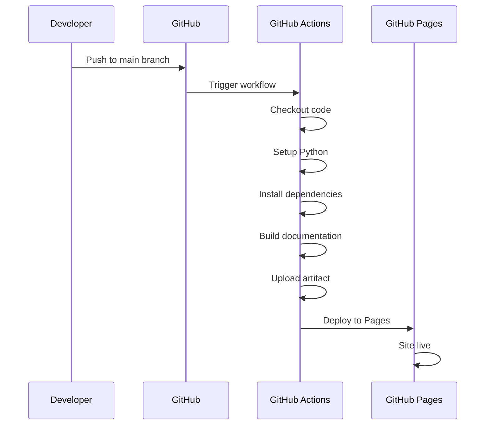

# Architecture Overview

## Documentation Site Architecture



## Content Structure

```
keycloak-ops/
├── docs/                          # Documentation source
│   ├── index.md                  # Homepage
│   ├── getting-started/          # Getting started guides
│   ├── installation/             # Installation docs
│   ├── operations/               # Operational guides
│   └── reference/                # Reference materials
├── mkdocs.yml                    # MkDocs configuration
├── requirements.txt              # Python dependencies
├── .github/workflows/            # CI/CD workflows
│   └── deploy-docs.yml
└── README.md                     # Project documentation
```

## Deployment Pipeline



## Technology Stack

- **Static Site Generator:** MkDocs
- **Theme:** Material for MkDocs
- **Hosting:** GitHub Pages
- **CI/CD:** GitHub Actions
- **Version Control:** Git
- **Content Format:** Markdown with extensions

## Key Components

### MkDocs Configuration (`mkdocs.yml`)
- Site metadata and settings
- Theme configuration with light/dark mode
- Navigation structure
- Markdown extensions for enhanced features

### Content Organization
- Modular structure with clear separation of concerns
- Cross-referenced documentation sections
- Consistent formatting and style

### CI/CD Pipeline
- Automated testing and building
- Secure deployment to GitHub Pages
- Status monitoring with badges

This architecture ensures maintainable, scalable, and user-friendly documentation delivery.